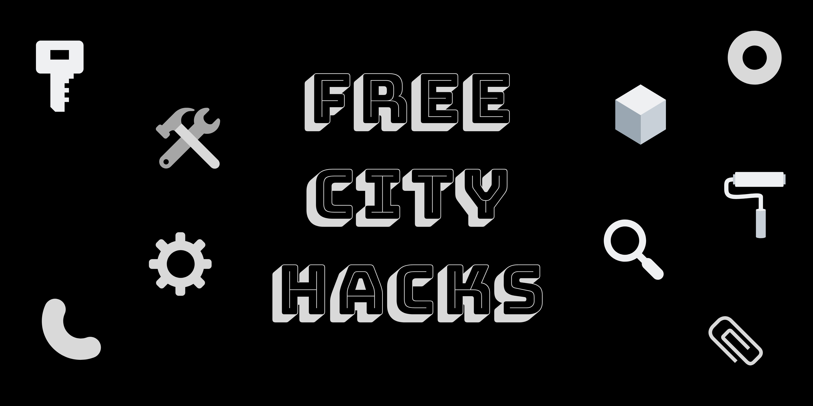

# Free City Hacks

Building up from the team that organized and facilitated [HacktoberfestinAba](https://HacktoberfestinAba.github.io), we've structured *Free City Hacks* to operate as a developer-focused platform that works to improve the local tech experience by providing access to 'up-to-date' digital learning resources and support for the exploration and use of top-notch programming environments and magical maker kits leveraging the power of open source in celebrating our local maker culture.

## Our Vision

Developers hate stress. We'd love keeping it that way. [*#ultracogence*](https://twitter.com/freecityhacks/status/1183753003754557442)

## Our Mission

To achieve this, we've made it our core mission to find sustainable ways for improving developers' access to rapidly evolving tech trends and to provide the required assistance for young people to get acquainted with physical computing and digital making and, through their regular participation in our inspiring, practical-based, learning sessions and hands-on labs, supercharge and promote our signature *hashtag* alongside the products and services we are developing independently or in collaboration with our partners.

## The Hashtag

The hashtag *#ultracogence* defines a clearly defined approach towards improving the traditional, inspirational artistry in our rapidly evolving technological ecospace with due respect to our positively diverse, yet inclusive cultural heritage just by keeping things simple, stupid.

## Our Activities

Specifically, we plan, organize, and facilitate tech meetups, workshops and festivals that promote community-driven education, peer-to-peer collaboration, as well as provide a convenient avenue for seamless networking among enthusiasts and professionals alike within the tech industry. All our events are, therefore, well-planned and structured to be of high quality, rich in content, experienced within a fun, secure, and inclusive environment, and uniquely identified by our signature hashtag *#ultracogence*.

Forwarding on the said vision, we are already working with the [Raspberry Pi Foundation](https://raspberrypi.org) to run two coder programs, [Raspberry Jam](https://raspberrypi.org/jam) and [CoderDojo](https://coderdojo.com), to support our collective learning and development.

Through both programs, we aim to inspire and encourage young people to get involved in the field of computing within an ecosystem where they find it easy to access and tinker with innovative programming tools to build aesthetically enhanced and interactive platforms.

## Author

* [David C.](https://github.com/davidconoh)
 
## Maintainers/Advocates

* [Andrew Miracle](https://github.com/koolamusic)
* [Fay Vor](https://github.com/phavor)
* [Opara Prosper](https://github.com/OPARA-PROSPER)

## Visit Us

Care to explore any of our platforms? Visit us:

Social:

* [Facebook](https://facebook.com/freecityhacks)
* [Twitter](https://twitter.com/freecityhacks)
* [Eventbrite](https://freecityhacks.eventbrite.com)

Work:

* [GitHub](https://github.com/freecityhacks)
* [Dojo](https://zen.coderdojo.com/dojos/ng/aba/aba-freecityhacks)
 
# Contributing & Volunteering

Knowing that open-minded, voluntary contributions to projects like this require high-value awesomeness, we are readily on the lookout for cool people like you who are interested in helping out on this platform. Care, just a step further, to leave us a [tweet](https://twitter.com/freecityhacks) and we will be glad to give you a welcoming response.

Yeah, right. You bet we would.

On the other hand, if you however are interested in exploring our platform to:
* help mentor young learners
* share knowledge and experience with the wider tech community 
* host, maintain, and/or collaborate on a new or existing open source project throught this platform
* contribute to improving our structure and experience, and advocating for the future of this platform

We would be very pleased to provide you with the most amazing support. Simply contact [freecityhacks@outlook.com](mailto://freecityhacks@outlook.com)

We also encourage you to catch up on our [CONTRIBUTORS_GUIDE](https://github.com/freecityhacks/fch-docs/blob/master/CONTRIBUTORS_GUIDE.md) to learn more about our accepted standards and best behavioural practices. If you are one to look out for convenience, you're in luck. See our Safeguarding Policy at [SAFEGUARDING](https://github.com/freecityhacks/fch-docs/blob/master/SAFEGUARDING.md).

We also welcome suggestions on improving our docs which you can easily do by creating an [Issue](https://help.github.com/en/articles/about-issues). We promise to look into it. as soon as possible.

Looking forward to reading your **Hello, world!** message. Cool you!!

<(-_*)>

# License

This project is licensed under the MIT License - see the [LICENSE](https://github.com/freecityhacks/fch-docs/blob/master/LICENSE) file for details.