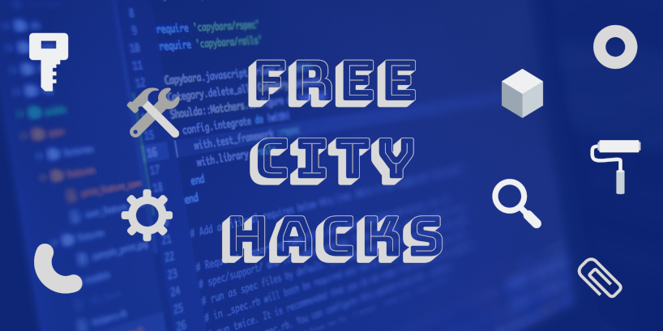

# Free City Hacks

Building up from the team that organized and facilitated [HacktoberfestinAba](https://HacktoberfestinAba.github.io), **Free City Hacks** is structured as a developer-focused platform that works to provide access to 'up-to-date' digital learning resources and support for the exploration and use of top-notch programming environments and magical maker kits, leveraging the power of open source.

## Our Vision

Our vision is to supercharge the fun in Africa's developer ecosystem.

## Our Mission

To achieve this, we've made it our core mission to make it easier for local developers to connect with rapidly evolving tech trends and provide the relevant assistance for young people to engage in physical computing and digital making through practical-based, learning sessions and hands-on labs.

### Our Activities

On a simple note, we plan, organize, and facilitate tech meetups, workshops and festivals that promote community-driven education, peer-to-peer collaboration and seamless networking among enthusiasts and professionals in the tech industry. All our events are therefore well planned and structured to be of high quality, rich in content and experienced within the most fun, secure, and inclusive environment.

To this effect, we are very delighted to be working with the [Raspberry Pi Foundation](https://raspberrypi.org) to run two coder programs, [Raspberry Jam](https://raspberrypi.org/jam) and [CoderDojo](https://coderdojo.com), to support learning and development.

Through both programs, we aim to inspire and encourage young people to get involved in the field of computing where thy are free to tinker with programming tools like Scratch and Python, and build interactive devices using microcontrollers like the Arduino board.

 ## Lead Advocate

 * [David C.](https://github.com/davidconoh)
 
 ## Advocates

 * [Andrew Miracle](https://github.com/koolamusic)
 * [Fay Vor](https://github.com/phavor)
 * [Opara Prosper](https://github.com/OPARA-PROSPER)

 ## Visit Us

Check us out on these platforms:

 * [Facebook](https://facebook.com/freecityhacks)
 * [Twitter](https://twitter.com/freecityhacks)
 * [GitHub](https://github.com/freecityhacks)
 * [Eventbrite](https://freecityhacks.eventbrite.com)
 
 # Contributing & Volunteering

If you are interested in helping us achieve more, kindly reach out to [freecityhacks@outlook.com](mailto://freecityhacks@outlook.com). Also, feel free to read up on our [CODE_OF_CONDUCT](https://github.com/freecityhacks/fch-docs/blob/master/CODE_OF_CONDUCT.md) to learn more about our accepted standards and behaviours.

Thank you.

 # License

This project is licensed under the MIT License - see the [LICENSE](https://github.com/freecityhacks/fch-docs/blob/master/LICENSE) file for details.