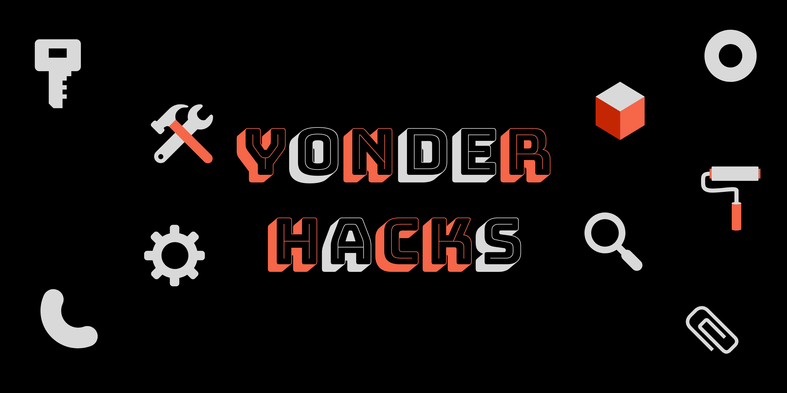

# Yonder Hacks

`````````````````````````````````````````````

* Copyright Yonder Hacks Contributors

* SPDX Identifier: Apache-2.0

``````````````````````````````````````````````

We are more than just a name. We are a game changer.



 
## Our Mantra

#Ultracogence - Supercharging your tech experience. One event at a time ! ! !

## The Hashtag

Our signature hashtag #Ultracogence envelops a clearly defined approach towards improving the traditional, inspirational artistry in our rapidly evolving technological ecospace with due respect to our positively diverse, yet inclusive cultural heritage just by keeping our activities simplified. Join us every year as we celebrate the open culture and engage in the global hacking experience, our own way.

## Our Work

From all around the world of digital making, we hunt for the latest stories covering inventions, discoveries, products releases as well as world-class learning resources to fuel your enganement with evolving technologies. Actually, we'd like you to know what's out there now, what's coming soon enough, and what's not looking like scoring the big leap into tomorrow so you can always easily employ current tech trends in hacking your everyday life.

Plus, for our awesome developers, we bring in regular jams and seasoned workshops crafted by global hacker community just to spice up your experience and keep the journey relatively stress-free.

## Team

### Author

* [David Onoh](https://github.com/davidconoh)
 
### Project Leads

* [Favour George](https://github.com/phavor)
* [Opara Prosper](https://github.com/kodekage)

### Maintainers

* [Andrew Miracle](https://github.com/koolamusic)
* [Vincent Iroleh](https://github.com/vincentiroleh)

### Mentor

* [Anya Uchenna](https://github.com/uchennaanya)

## Visit Us

Care to explore any of our platforms? Visit us:

Social:

* [LinkedIn](https://linkedin.com/company/yonderhacks)
* [GitHub](https://github.com/yonderhacks)
* [Eventbrite](https://yonderhacks.eventbrite.com)
 
## Contributing & Volunteering

Knowing that open-minded, voluntary contributions to projects like this require high-value selflessness, we are readily on the lookout for cool people who are interested in helping to improve community-centered tech experience.:

* See us @[Yonder Hacks](https://linkedin.com/company/yonderhacks) and we will be glad to give you a welcoming response.

* If you are interested in supporting the work we do in our jams, simply contact [yonderhacks@outlook.com](mailto://yonderhacks@outlook.com)

* We encourage you, as well, to catch up on our [CONTRIBUTORS_GUIDE](https://github.com/yonderhacks/yh-docs/blob/master/CONTRIBUTORS_GUIDE.md) to learn more about our accepted standards and best behavioural practices. If you are one to look out for convenience, you're in luck. See our Safeguarding Policy at [SAFEGUARDING](https://github.com/yonderhacks/yh-docs/blob/master/SAFEGUARDING.md).

* We also welcome suggestions on improving our docs which you can easily do by creating an [Issue](https://help.github.com/en/articles/about-issues). We promise to look into it. as soon as possible.

Looking forward to reading your **Hello, world!** message.

Stay awesome!! <(-_*)>

tails.

## Change History

- **ver. 0.1** Initial Draft, 19 October 2019
- **ver. 0.2** Update with Notice, 27 June 2021

## Maintainer

[Favour George](https://github.com/phavor)
